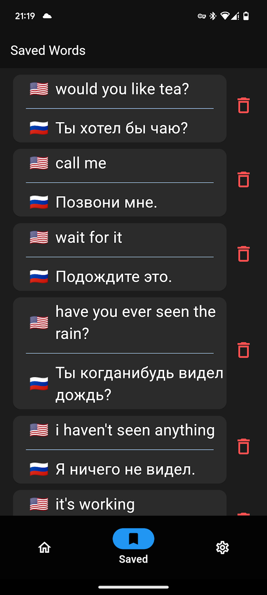

# Translator
## Description
 
This is a mobile app for translating texts between the following languages: English, Russian, French, and Spanish. The app is developed using Dart and Flutter.

 For this app to function correctly, you need to upload the model which will translate texts on the server. Personally, I found a list of sentences in different languages, scraped the data, and used it to train [this model](https://github.com/ymoslem/OpenNMT-Tutorial). After saving the model, I uploaded it to my server.

## Key features
1) Bookmarking: You can add words or sentences to bookmarks.
2) Animations: Smooth animations are included when deleting a word from bookmarks.
3) Responsive UI: The user interface scales dynamically based on the screen size.  
4) Theme Customization: You can switch between a dark theme and a light theme without restarting the app.
5) Languages: Choose between four languages: English, Russian, French, and Spanish.

## Screenshots

## Video
You can see how the app works here - [clicl here to open](https://youtube.com/shorts/73lcbp81qis?feature=share)

## **Unfortunately, as of now, I disconnected servers because they're very expansive and I can't pay for them**
